# 가구조립 시뮬레이터 (Furniture Assemble Simulator)

## 설치 요구사항
  - 언리얼 엔진 4.26 이상
  - Visual Studio 2017 이상

## 설치 및 실행 방법
  1. FurnitureAssembleSimulator Repository를 Clone 또는 Download 하고 압축을 해제
  2. 압축 해제된 폴더에서 FurAssembleSimulator.uproject 를 실행
  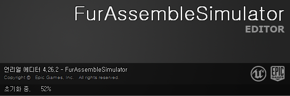

  3. 언리얼엔진 Funiture Assemble Simulator Editor가 정상적으로 실행
  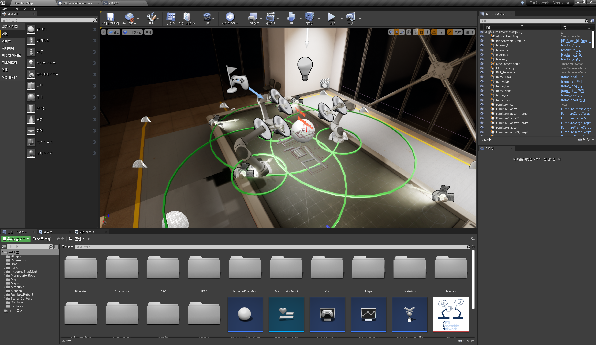

## PDDL 파일 설정 방법
  1. FAS Editor 화면에서 아래 콘텐츠 부분 영역에서 WB_FAS 파일을 찾아 더블 클릭
  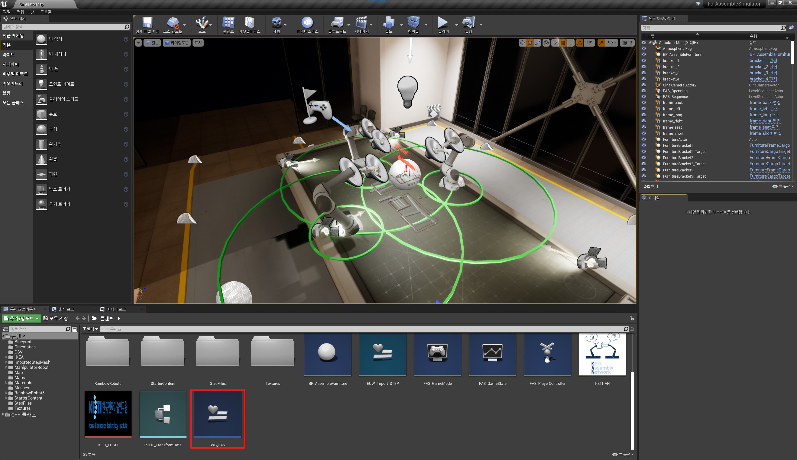
  
  2. WB_FAS 창이 열리면 오른쪽 상단의 [그래프]를 클릭
  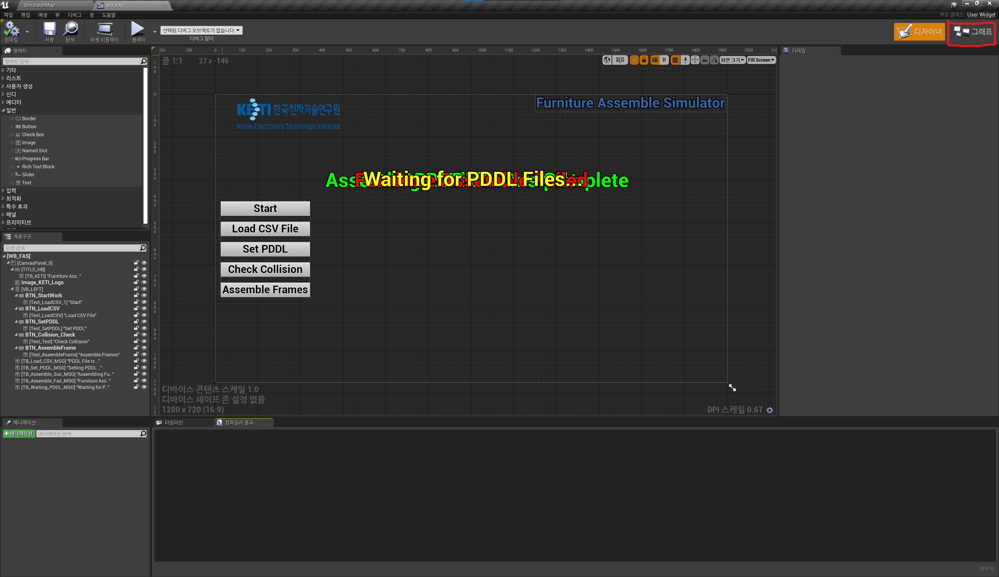
  
  3. 왼쪽 [함수] 부분에 WaitForFiles 함수를 더블 클릭
  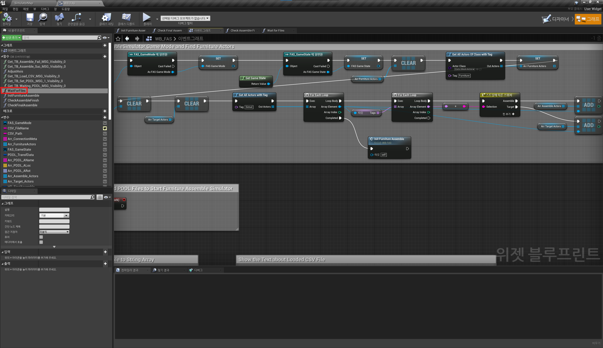
  
  4. 중앙화면에 있는 1번 [PDDL Folder Path] 변수를 선택하고, 2번 부분에 PDDL 파일과 가구조립연결관계가 쓰여있는 CSV 파일의 폴더 절대경로를 적음
  
  
  5. 3번의 [CSV File Name] 변수를 선택하고, 4번 부분에 가구조립연결관계가 쓰여있는 CSV 파일의 이름을 적음
  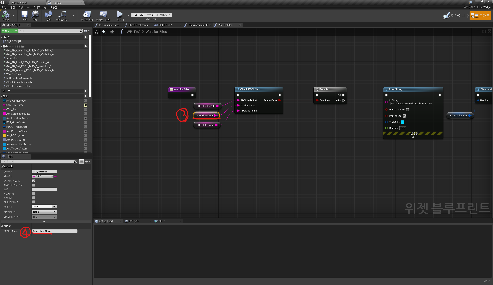
  
  6. 5번의 [PDDL File Name] 변수를 선택하고, 6번 부분에 PDDL 파일의 이름을 적음
  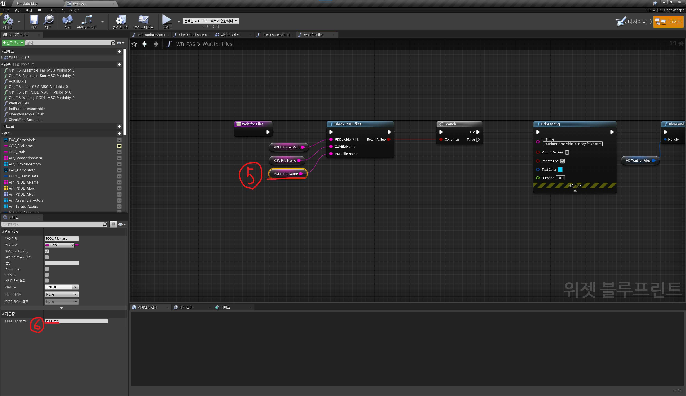
  
  7. 상단의 [저장] 버튼을 누르고, 왼쪽에 [컴파일] 버튼을 눌러 컴파일함
  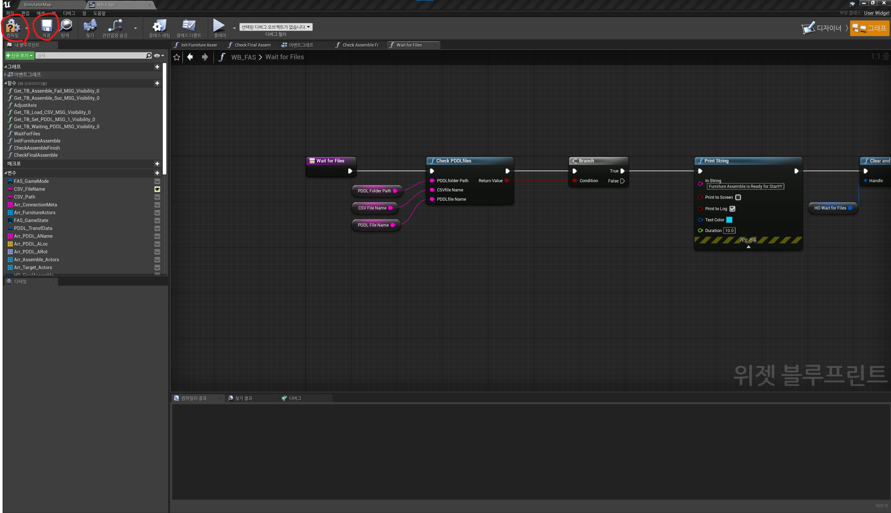
  
## 가구 조립 시뮬레이터 실행
  1. 다시 왼쪽 상단의 [SimulatorMap]을 눌러 처음 Editor 화면으로 돌아온 후, 상단의 오른쪽 끝부분에 있는 [플레이]를 눌러 실행
  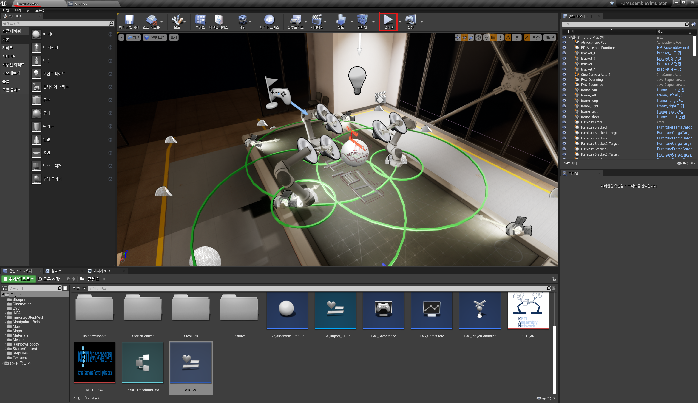
  
  2. 정상적으로 PDDL 파일 설정을 완료하였으면 가구 조립 시뮬레이터가 동작
  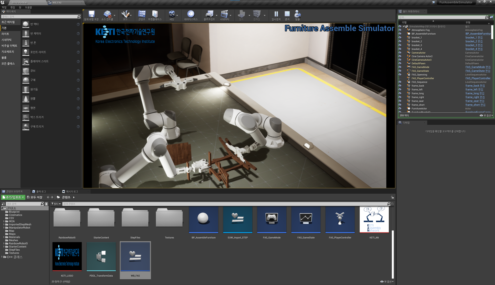
  
  3. 만약 PDDL 파일 설정을 잘못하였거나 파일이 하나라도 없을 경우, 계속해서 주기적으로 파일 여부를 확인하여 파일을 기다리는 상태가 됨
  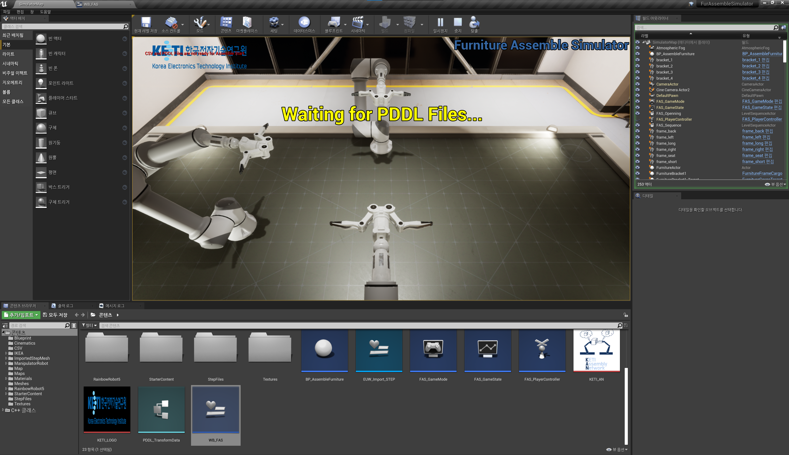
